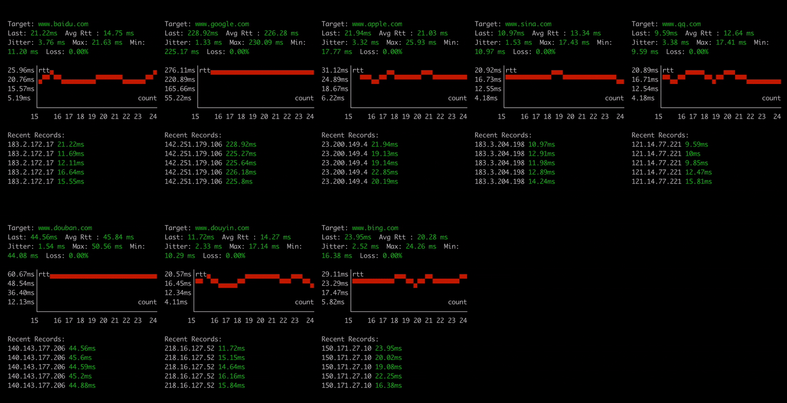

<h1 align="center"> 🏎 Nping </h1>
<p align="center">
    <em>Nping is a Ping tool developed in Rust. It supports concurrent Ping for multiple addresses, visual chart display, real-time data updates, and other features.</em>
</p>

<p align="center">
    
</p>

<p align="center">
    <a href="https://hellogithub.com/repository/21f5600774554866a3d686308df2dbf0" target="_blank">
        
    </a>
<a href="https://trendshift.io/repositories/13472" target="_blank"></a>
</p>

[中文文档](./README_ZH.md)

**[New Feature] 🛰️ Nping Prometheus Exporter Now Supported**

Now, Nping supports exporting ping metrics to Prometheus format. You can use the exporter subcommand to start the exporter server. [Learn more](#exporter-mode)

```bash
nping exporter www.baidu.com www.google.com -i 1 -p 9100
```
Then, you can scrape the metrics from `http://localhost:9100/metrics`

**Graph View**
<p align="center">
    
</p>

**Table View**
<p align="center">
    
</p>

**Point View**
<p align="center">
    
</p>

**Sparkline View**
<p align="center">
    
</p>


#### Exporter Mode
Now Nping supports exporting ping metrics to Prometheus format. you can use exporter subcommand to start the exporter server.

```bash
nping exporter www.baidu.com www.google.com -i 1 -p 9100
```
Then, you can scrape the metrics from `http://localhost:9100/metrics`

You can use grafana to visualize the data
<p align="center">
     
</p>


## Installation

#### MacOS Homebrew
```bash
brew tap hanshuaikang/nping
brew install nping

nping --help
```

## Feature:
- TCP Ping support
- IP range Ping support

## Roadmap:
- Optimize UI interface, add more dynamic effects.

## Usage

```bash
nping www.baidu.com www.google.com www.apple.com www.sina.com -c 20 -i 2

nping --help

🏎  Nping mean NB Ping, A Ping Tool in Rust with Real-Time Data and Visualizations

Usage: nping [OPTIONS] <TARGET>...

Arguments:
  <TARGET>...  target IP address or hostname to ping

Options:
  -c, --count <COUNT>          Number of pings to send [default: 65535]
  -i, --interval <INTERVAL>    Interval in seconds between pings [default: 0]
  -6, --force_ipv6             Force using IPv6
  -m, --multiple <MULTIPLE>    Specify the maximum number of target addresses, Only works on one target address [default: 0]
  -v, --view-type <VIEW_TYPE>  View mode graph/table/point/sparkline [default: graph]
  -o, --output <OUTPUT>        Output file to save ping results
  -h, --help                   Print help
  -V, --version                Print version

```

### Exporter Usage

```bash
nping exporter www.baidu.com www.google.com -i 1 -p 9100

./nping exporter --help
Exporter mode for monitoring

Usage: nping exporter [OPTIONS] <TARGET>...

Arguments:
  <TARGET>...  target IP addresses or hostnames to ping

Options:
  -i, --interval <INTERVAL>  Interval in seconds between pings [default: 1]
  -p, --port <PORT>          Prometheus metrics HTTP port [default: 9090]
  -h, --help                 Print help
```


## Acknowledgements
Thanks to these people for their feedback and suggestions for 🏎Nping!

| [ThatFlower](https://github.com/ThatFlower) | [zx4i](https://github.com/zx4i) | [snail2sky](https://github.com/snail2sky) | [shenshouer](https://github.com/shenshouer) | [vnt-dev](https://github.com/vnt-dev) | [qingyuan0o0](https://github.com/qingyuan0o0) 
| [Onlywzr](https://github.com/Onlywzr)

Thanks to these self-media for reposting and paying attention to 🏎Nping!

| [阮一峰的网络日志](https://www.ruanyifeng.com/blog/weekly/) |[Rust 中文社区](https://rustcc.cn/) | [公众号:奇妙的linux世界](https://mp.weixin.qq.com/s/lK_OqKp2yY8lDBoyLxtdGA) | [公众号:IT运维技术圈](https://mp.weixin.qq.com/s/bDJZ-H02dIKG3R7LQCeyaQ)
| [X:@geekbb](https://x.com/geekbb/status/1875754541905539510) | [公众号:一飞开源](https://mp.weixin.qq.com/s/BZjr54h8dIQgzr8UW3fwOQ) | [公众号: 开源日记](https://mp.weixin.qq.com/s/uGtkD4x_XOFyKNbIy5pHYA)

## Star History
[](https://star-history.com/#hanshuaikang/Nping&Date)